# **Git and Gitlab practical assignment**

## Created by **Arbaaz Mujawar**

### **Main Task: GitHub & GitLab Collaboration & Workflow Setup**

You are part of a DevOps team working on two different platforms – GitHub and GitLab. Your team wants to ensure smooth development, proper access control,and repository mirroring between the two platforms.

---

## **PART 1: GitHub Tasks**

### **Subtask 1 : Repository Setup on GitHub**

**Task Description :**

1. Created two repositories on GitHub:
   - One Public Repository
   - One Private Repository

2. Purpose
   - Public repos are used for open-source or portfolio projects.
   - Private repos are used for company or confidential projects.

---

### **Screenshot**

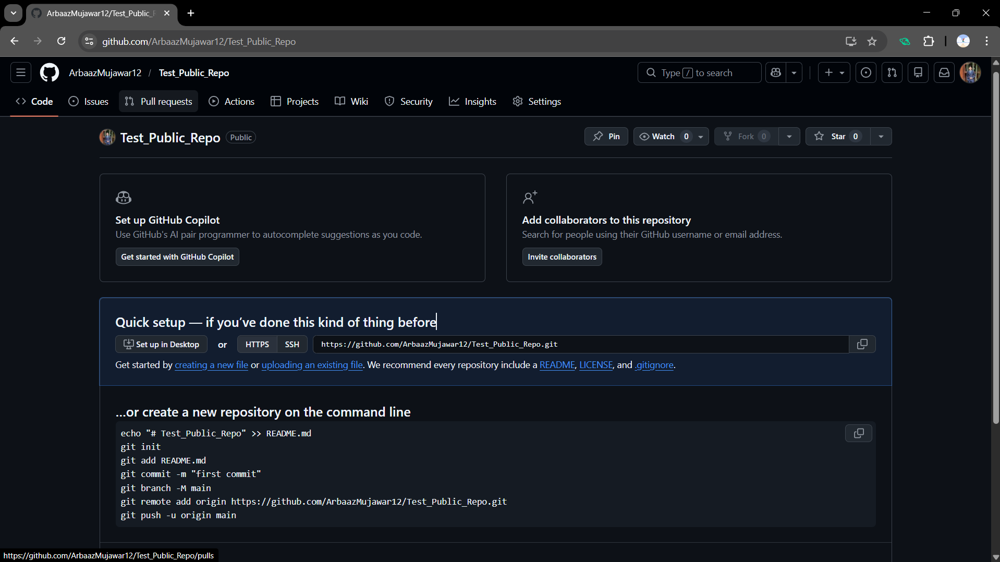

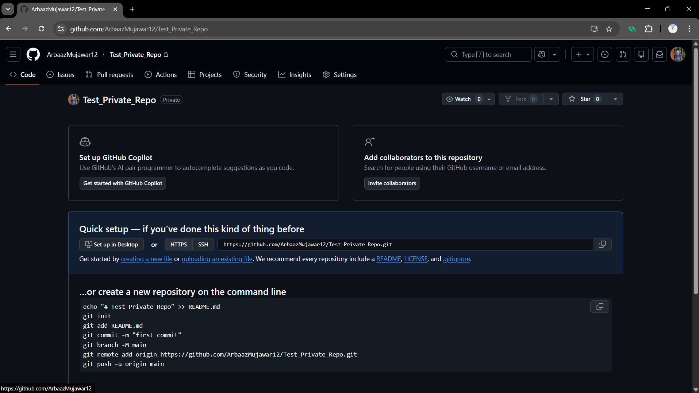

---

### **Subtask 2 : Local Development & Branching**

1. Cloning Repositories :
   - Both repositories were cloned locally using HTTPS.

   ```bash
   git clone <repository-url>
   ```

2. Creating a Development Branch :
   - In the private repository, a new branch named dev was created.

   ```bash
   git checkout -b dev
   git checkout -b main
   ```

3. Adding Files :

   Files added:
   - index.html

   - README.md

4. Commits :

   At least two commits were made to track changes.

   ```bash
   git add .
   git commit -m "Initial commit"
   git commit -m "Updated project files"
   ```

5. Push dev Branch :

   ```bash
   git push origin dev
   ```

6. **Why We Use a dev Branch ?**
   - Keeps main branch stable

   - Allows development without breaking production code

---

### **Screenshot**

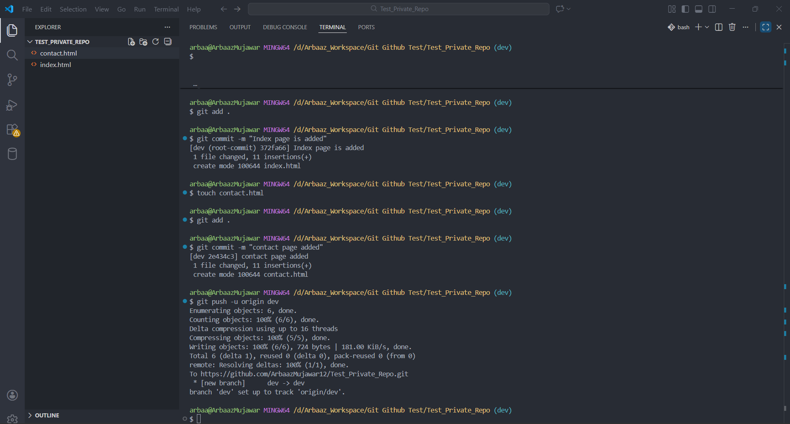

---

### **Screenshot**

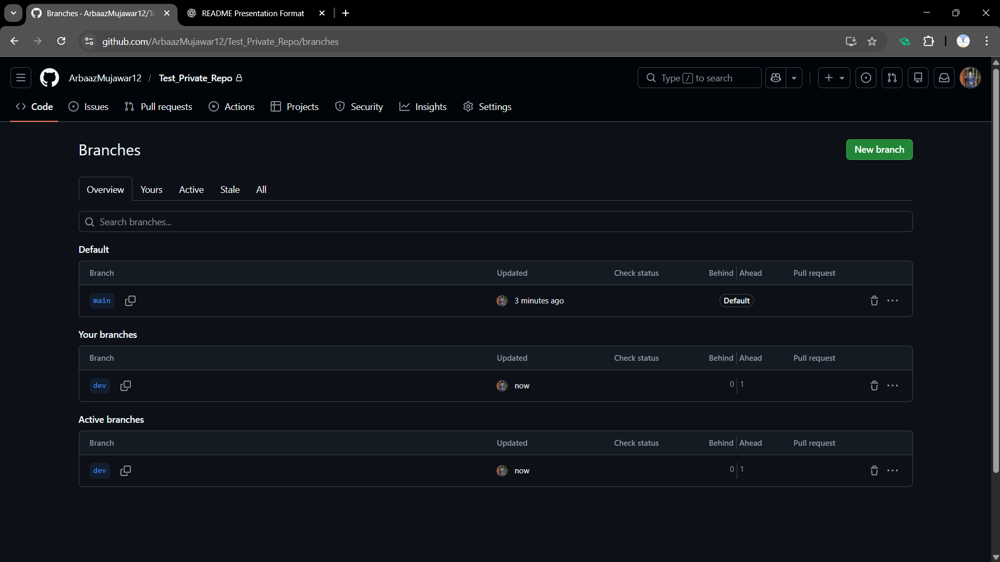

---

### **Subtask 3 : Collaboration Workflow**

1. Creating a Pull Request :

   A Pull Request was created on GitHub to merge:

   **dev → main**

2. Review & Merge :
   - The PR was reviewed

   - Successfully merged into the main branch

3. **Why Pull Requests Are Important ?**
   - Enables code review

   - Prevents direct changes to main branch

---

### **Screenshot**

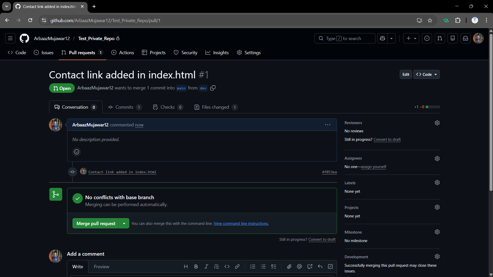

---

### **Screenshot**

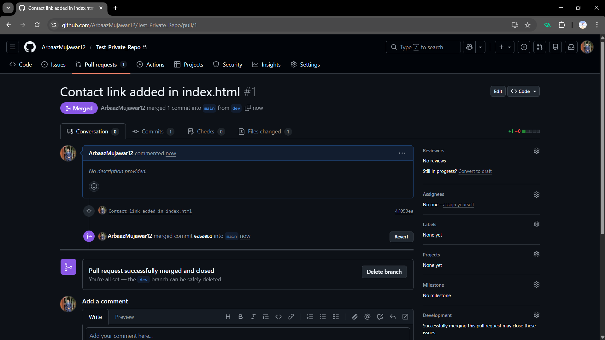

---

### **Screenshot**

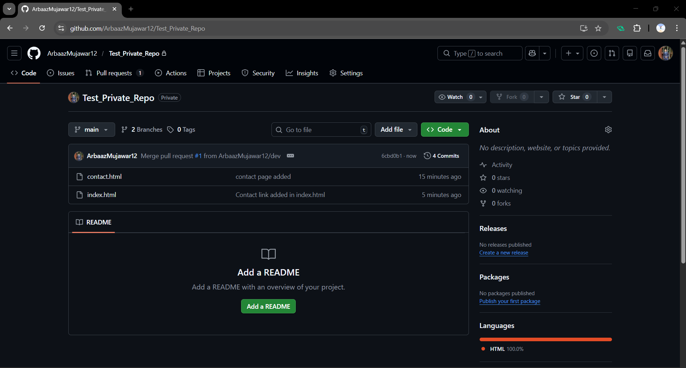

---

## **PART 2: GitLab Tasks**

### **Subtask 4 : GitLab Repository Setup**

1. Repository Creation :

   Created a private repository on GitLab

2. Cloning Using SSH :

   Repository cloned using SSH.

   ```bash
   git clone git@gitlab.com:username/repo-name.git
   ```

3. **Why SSH?**
   - More secure

   - No need to enter username/password repeatedly

4. Created a basic project structure :

   ```css
   src/
   └── app.py
   docs/
   └── guide.md
   ```

5. Push to Gitlab :
   ```bash
   git add .
   git commit -m "Initial Commit"
   git push origin main
   ```

---

### **Screenshot**

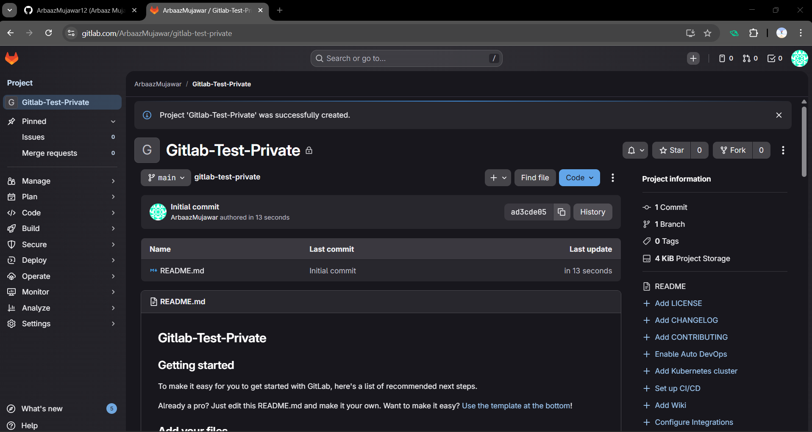

---

### **Screenshot**

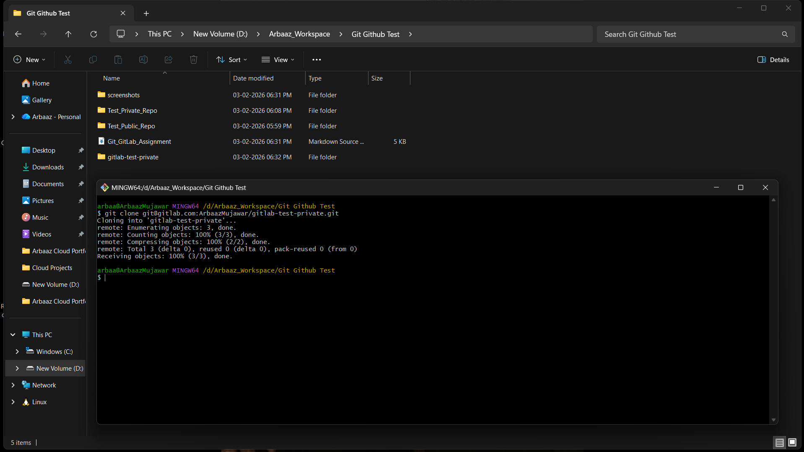

---

### **Subtask 5 : Repository Mirroring (GitLab → GitHub)**

1. Create a mirror setup :

- Set the GitHub private repo as the mirror of your GitLab repo.
- Push some changes to GitLab and verify if the changes reflect in GitHub automatically.

2. Mirror Setup :
   - GitHub private repository was set as a mirror of the GitLab repository

   - Configured push mirroring

3. Result
   - Any push to GitLab automatically reflects in GitHub

```bash
git push origin main
```

3. Verification
   - Changes pushed in GitLab appeared in GitHub without manual push.

---

### **Screenshot**

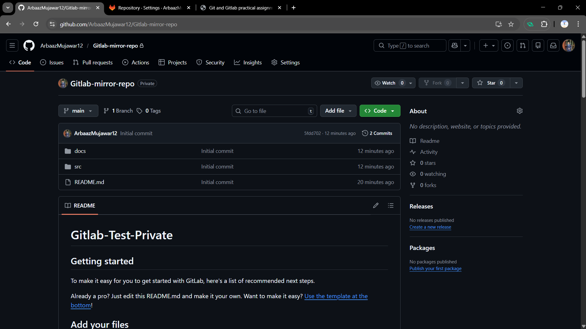

---

### **Subtask 6 : Access Control in GitLab**

1. Adding a Collaborator
   - A friend was invited to the GitLab private repository

2. Guest Role
   - Initially assigned Guest

   - Guest can:
     - View project

     - Cannot push code

3. Developer Role
   - Role changed to Developer

   - Developer can:
     - Clone repo

     - Push commits

     - Create branches

---

### **Screenshot**

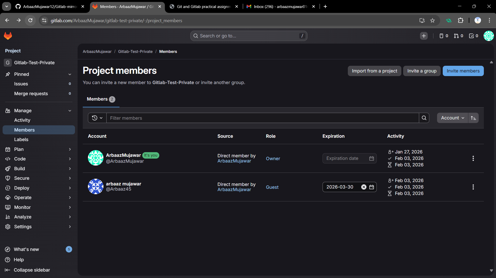

---

### **Screenshot**

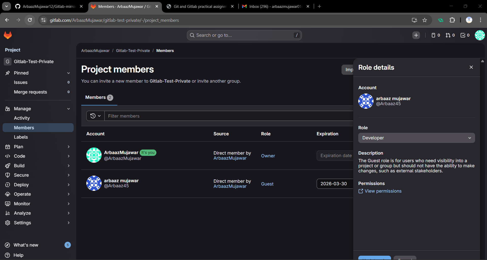

---
